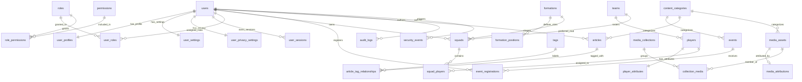

# RIVALRY 90 — Entity Relationship Diagram (`DATABASE_ER_DIAGRAM.md`)

Authoritative Mermaid source is also maintained at [er-diagram.mmd](../database/diagrams/er-diagram.mmd).

```mermaid
erDiagram
  users ||--|| user_profiles : "has_profile"
  users ||--|| user_settings : "has_settings"
  users ||--|| user_privacy_settings : "has_privacy"
  users ||--o{ user_sessions : "owns_sessions"
  users ||--o{ user_roles : "assigned_roles"
  roles ||--o{ user_roles : "granted_to"
  roles ||--o{ role_permissions : "grants"
  permissions ||--o{ role_permissions : "included_in"
  users ||--o{ squads : "owns"
  teams ||--o{ players : "rosters"
  players ||--|| player_attributes : "has_attributes"
  formations ||--o{ formation_positions : "defines_slots"
  formations ||--o{ squads : "shapes"
  teams ||--o{ squads : "preferred_club"
  squads ||--o{ squad_players : "contains"
  players ||--o{ squad_players : "assigned_to"
  content_categories ||--o{ events : "categorizes"
  events ||--o{ event_registrations : "receives"
  users ||--o{ event_registrations : "registers"
  users ||--o{ articles : "authors"
  content_categories ||--o{ articles : "categorizes"
  articles ||--o{ article_tag_relationships : "tagged_with"
  tags ||--o{ article_tag_relationships : "labels"
  content_categories ||--o{ media_assets : "categorizes"
  media_assets ||--o| media_attributions : "attributed_by"
  media_collections ||--o{ collection_media : "groups"
  media_assets ||--o{ collection_media : "member_of"
  users ||--o{ audit_logs : "actors"
  users ||--o{ security_events : "triggers"
```

